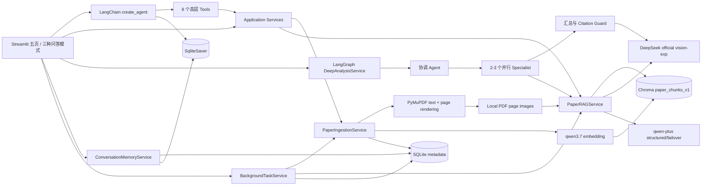

# 系统架构



## 导入事务

```text
pending → validating → parsing → chunking → embedding → indexing → ready
                                                               └→ failed
```

所有入口（本地路径、Streamlit 上传、arXiv 下载）最终调用同一个 `PaperIngestionService`。服务先校验扩展名、magic bytes、大小、加密状态和页数，再计算 SHA-256。原 PDF 进入 `data/papers/<paper_id>/` 受控快照，派生结果进入 `data/parsed/<paper_id>/v<version>/`。

失败时删除该论文版本的半成品向量并把 job/version 标记为 failed。失败版本允许相同 SHA 重试；已有 ready version 的新版本失败时，旧 active version 仍保持 ready。

## 向量与元数据

稳定 ID：

```text
{paper_id}:v{version}:p{pdf_page:04d}:c{chunk_on_page:03d}
```

Chroma 保存正文、embedding 和查询所需 metadata；SQLite 保存论文、版本、导入任务、检索 trace、完整可见会话、引用快照和用户偏好。Chroma 不是会话记忆，SQLite 中的历史回答也不是论文事实库。

## 后台任务

本地/arXiv 导入、全文摘要和多论文比较由 `BackgroundTaskService` 提交到受限线程池。`background_tasks` 表保存请求、状态、进度、当前步骤、结果、错误与取消标记。页面以 Streamlit fragment 轮询，不依赖某一次 rerun 的内存对象；应用重启时，未完成任务会按持久化请求恢复执行。同一外部 API 调用内部不能中断，因此取消属于协作式取消。

## RAG 不变量

1. 只查询 `status=ready` 的 `active_version`。
2. 多论文检索逐篇执行，禁止单次全局 Top-k。
3. 全文摘要读取当前版本全部 chunks，采用 Map-Reduce。
4. 模型只返回临时引用 ID；程序映射真实论文、版本、页码、chunk 与原文。
5. 非法、跨范围或不存在的引用触发拒绝；无引用的确定性回答转为证据不足。
6. 比较先生成每篇 `PaperProfile`，再对齐九个维度；不同任务/数据集/指标必须标为不可直接比较。

## 目录

```text
research-copilot/
├── src/research_copilot/
│   ├── agent.py              # create_agent 与中间件组合
│   ├── deep_analysis.py      # Supervisor / Send workers / reducer
│   ├── tools.py              # 八个高层 Tool
│   ├── ingestion.py          # 导入事务与页内分块
│   ├── background_tasks.py   # 持久化后台任务、恢复与取消
│   ├── parsers.py            # PyMuPDF text/page images + optional MinerU
│   ├── rag.py                # 检索、引用、摘要、比较
│   ├── vector_index.py       # Chroma 适配器
│   ├── storage.py            # SQLite repository
│   ├── conversation_memory.py # 工作区、消息、摘要和生命周期
│   ├── exports.py            # 会话与比较 Markdown/JSON 导出
│   └── services.py           # 依赖装配
├── streamlit_app.py
├── tests/
└── data/                     # 运行数据；绝大部分被 Git 忽略
```
