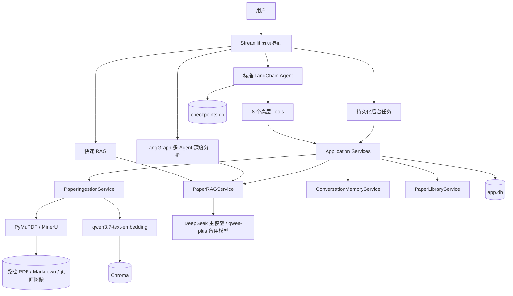

# Research Copilot 代码导读与面试说明

本文面向两种用途：

1. 帮助开发者从代码层理解 Research Copilot v0.2 是如何构建的；
2. 帮助项目作者在面试中讲清楚架构、关键实现、工程取舍、问题排查和后续演进。

建议先读第 1～4 节建立全局认识，再结合第 18～20 节准备面试表达。文中描述以当前仓库代码为准，不把未来设想表述为已经完成的功能。

## 1. 一句话介绍项目

Research Copilot 是一个面向本地 PDF 和 arXiv 论文的证据型科研助手：它把论文解析并建立向量索引，通过受控 RAG 回答问题，所有论文事实都必须映射到真实 PDF 页码和原文证据；同时支持全文摘要、多论文九维比较、多 Agent 深度分析、长期会话以及持久化后台任务。

面试时可以进一步强调：

- 项目重点不是“让大模型自由聊天”，而是约束模型只能在本轮检索证据内回答；
- Agent 只负责意图识别和高层工具选择，导入事务、检索、引用校验等关键流程由 Service 层确定性执行；
- Chroma、SQLite、LangGraph Checkpoint 和 Streamlit session state 分别保存不同类型的状态，没有把所有数据混在一个“记忆”概念中；
- 项目包含真实评测集、故障恢复、引用防伪和版本管理，不只是 Notebook 形式的功能演示。

## 2. 总体架构



架构可以概括成四层：

- 表现层：`streamlit_app.py` 和 CLI；
- 编排层：标准 Agent、LangGraph 深度分析、后台任务；
- 业务层：导入、RAG、论文库、会话记忆等 Service；
- 基础设施层：模型 API、PyMuPDF/MinerU、Chroma、SQLite 和本地文件系统。

## 3. 技术栈与职责

| 技术 | 在项目中的职责 | 为什么使用 |
| --- | --- | --- |
| LangChain 1.2 | 模型统一初始化、Tools、Agent Middleware | 验证所学 Agent 架构，并减少不同 OpenAI-compatible 模型的适配代码 |
| LangGraph | Checkpoint、HITL、多 Agent `StateGraph + Send` | 需要可恢复的 Agent 状态以及有边界的并行 specialist |
| DeepSeek 官方模型 | 普通论文问答和视觉问答 | 当前实测响应较快，并支持页面图像输入 |
| qwen-plus | JSON/结构化任务和主模型故障备用 | 实验模型不稳定支持 `response_format`，结构化职责需要隔离 |
| qwen3.7-text-embedding | 文本向量化 | 与现有百炼账户集成，实测向量维度 1024 |
| PyMuPDF | 默认 PDF 文本解析、标题识别、页面渲染 | 本地、快、可控，不依赖 MinerU 网络状态 |
| MinerU | 可选的复杂公式/表格解析路径 | 结构恢复能力更强，但作为可降级实验路径而非单点依赖 |
| Chroma | 论文 chunk、向量和检索元数据 | 单机嵌入式部署适合当前个人论文库规模 |
| SQLite | 论文元数据、版本、任务、会话、引用快照、trace | 支持事务、WAL、迁移和本地持久化，部署成本低 |
| Streamlit | 五页可交互 Demo | 直接展示上传、任务进度、对话、证据和评测，无需另建前端工程 |
| Pydantic Settings/Models | 配置校验、SecretStr、领域模型与 Tool schema | 把输入约束从 prompt 下沉到代码 |
| pytest/Ruff | 离线回归和静态检查 | 默认测试不调用付费 API，便于持续验证 |

## 4. 代码目录地图

```text
research-copilot/
├── streamlit_app.py                   # 页面、会话交互、实时进度和证据展示
├── src/research_copilot/
│   ├── config.py                      # .env 配置、校验和数据目录
│   ├── model_factory.py               # 主模型、备用模型、Embedding 工厂
│   ├── services.py                    # ServiceContainer 与依赖装配
│   ├── models.py                      # 论文、chunk、Citation、回答、会话领域模型
│   ├── parsers.py                     # PDF 校验、标题识别、解析和页面渲染
│   ├── ingestion.py                   # 导入状态机、版本、分块、索引与回滚
│   ├── vector_index.py                # VectorIndex 协议与 Chroma 实现
│   ├── rag.py                         # 检索、问答、引用校验、摘要和比较
│   ├── agent.py                       # create_agent、Prompt 与 Middleware 组合
│   ├── tools.py                       # 8 个高层 Agent Tools
│   ├── middleware.py                  # Trace、论文范围策略和瞬时错误判定
│   ├── deep_analysis.py               # Supervisor / specialist / reducer 图
│   ├── conversation_memory.py         # 工作区、追问改写、消息与长会话摘要
│   ├── background_tasks.py            # SQLite 持久化任务和线程池执行器
│   ├── storage.py                     # SQLite schema、迁移和 Repository
│   ├── library.py                     # 删除、重建、页面图像和标题维护
│   ├── vector_repair.py               # Chroma staging 重建、校验、备份与切换
│   ├── evaluation.py                  # 真实问答、检索和分块参数评测
│   ├── exports.py                     # 会话/比较 Markdown 和 JSON 导出
│   └── cli.py                         # 命令行入口
├── data/eval/questions.example.jsonl  # 可复制的评测格式示例
├── tests/                             # 60 项离线测试
└── docs/                              # 架构、记忆、测试、演示和限制说明
```

## 5. 应用如何启动和完成依赖装配

入口有两个：

- `research-copilot serve` 最终启动 `streamlit_app.py`；
- CLI 的 `ingest`、`ask`、`compare`、`evaluate` 等命令直接调用同一批 Service。

`services.py` 中的 `build_services()` 是组合根（composition root）。它按顺序完成：

1. 从 `.env` 创建并校验 `Settings`；
2. 创建主 Chat 模型、备用 Chat 模型和 Embedding 模型；
3. 初始化 `SQLiteRepository`，执行 schema 迁移；
4. 创建持久化 `ChromaVectorIndex`；
5. 创建导入、arXiv、RAG 等基础服务；
6. 建立 `SqliteSaver` Checkpoint；
7. 补齐论文库、深度分析、会话记忆和后台任务服务。

这些依赖统一装入 `ServiceContainer`。这是一种显式依赖注入：没有使用额外 DI 框架，但测试可以传入 fake chat model、fake embedding 和临时数据库，从而避免在线费用。

Streamlit 使用 `_cached_runtime(schema_version)` 缓存重量级资源。`runtime()` 还会校验 Service 和 Repository 的关键接口；如果热重载仍保留旧类实例，就清理缓存并重建，避免“代码已经更新、缓存对象仍是旧版本”的问题。

## 6. 配置和模型工厂

### 6.1 Settings

`config.py` 使用 `pydantic-settings` 读取项目根目录 `.env`。关键点：

- API Key 使用 `SecretStr`，默认打印不会暴露明文；
- 相对的 `PROJECT_DATA_DIR` 会解析到项目根目录；
- `CHROMA_DATA_DIR` 可将向量索引与业务数据分离；Windows + Chroma 1.5.9 下应使用全英文绝对路径，避免 HNSW 索引在重启后无法读取；
- 校验 `chunk_overlap < chunk_size`；
- 校验最终上下文数量不能超过候选数量；
- 集中生成 papers、parsed、uploads、chroma、SQLite 和 reports 路径。

当前运行配置由 `.env` 覆盖代码默认值。不要在面试中说“密钥写在代码里”，实际设计是密钥只存在本地 `.env`，仓库只提交空值 `.env.example`。

### 6.2 模型分工

`model_factory.py` 没有让所有任务强行使用同一个模型：

- 主模型负责自然语言问答及视觉页面理解；
- qwen-plus 负责 schema 较重的论文画像、比较、深度分析规划等任务，也作为主模型超时/服务异常时的备用模型；
- DashScope Embedding 单独使用 `qwen3.7-text-embedding`。

模型层把 LangChain/OpenAI SDK 的内部重试设为 0。原因是嵌套重试可能造成三次完整 timeout，让 UI 看似“卡死”；可重试策略集中放在 Agent Middleware 或明确的 fallback/circuit breaker 中。

## 7. 论文导入管线

导入核心在 `PaperIngestionService.ingest_local()`，状态机为：

```text
pending → validating → parsing → chunking → embedding → indexing → ready
                                                                └→ failed
```

完整流程如下：

1. 创建 `job_id`，立即向 SQLite 写入 pending 状态；
2. 校验路径、扩展名、200 MB 限制、`%PDF-` magic bytes、加密状态和页数；
3. 计算 SHA-256，用于内容去重和版本判断；
4. 优先读取 PDF metadata 标题，否则根据首页字号、位置和多行关系推断标题，最后才回退文件名；
5. 生成稳定 `paper_id`，若 slug 冲突但标题不同，则附加哈希前缀；
6. 把原 PDF 复制到 `data/papers/<paper_id>/`，形成受控证据快照；
7. 默认用 PyMuPDF 解析文字并渲染页面图像；显式启用 MinerU 时先调用 MinerU，失败自动降级；
8. 清理高频页眉、页脚和纯页码，但保持 PDF 页边界；
9. 在单页内部进行递归字符分块；
10. 以每批 20 chunks 调用 Embedding，适配 DashScope batch 限制；
11. 写入 Chroma 后才把版本和论文标记为 ready；
12. 任意阶段异常时删除该版本的半成品向量并记录 failed，不破坏旧 active version。

### 7.1 稳定 chunk ID

```text
{paper_id}:v{version}:p{pdf_page:04d}:c{chunk_index:03d}
```

例如：

```text
paper-a:v1:p0015:c002
```

这个 ID 同时编码论文、版本、PDF 页和页内块序号，支持：

- 版本隔离；
- 引用合法性校验；
- 失败回滚和单版本删除；
- 历史证据追溯；
- 测试中验证页码稳定性。

### 7.2 为什么必须页内分块

如果 chunk 跨页，模型引用一个 chunk 时无法给出唯一 PDF 页码。本项目优先保证出处确定性，因此先按物理页隔离，再在页内切分。代价是跨页段落可能被拆开，这是准确引用和语义连续性之间的工程取舍。

## 8. Chroma 向量层

`vector_index.py` 先定义 `VectorIndex` Protocol，再由 `ChromaVectorIndex` 实现。这使 RAG 依赖抽象接口而不是直接依赖 Chroma；未来切换 Milvus 时主要增加适配器，不需要重写问答服务。

Collection 固定为 `paper_chunks_v1`，metadata 包含：

- paper_id 和 paper_version；
- paper_title；
- page_number 和 page_index；
- chunk_index_on_page；
- text_hash、section_hint、source_uri；
- embedding_model。

检索时只计算一次 query embedding，然后对每篇论文分别用 `paper_id + active_version` filter 查询。这样既避免重复支付多篇论文的 query embedding，又保证每篇论文都有自己的 Top-k，不会被长论文或高相似度论文抢光全局名额。

## 9. 单轮 RAG 问答链路

`PaperRAGService.ask()` 是项目最核心的受控事务。一次问题的主要链路是：

```text
问题
  → 校验 ready 论文和 active version
  → 必要时把追问改成独立检索问题
  → 确定性关键词扩展
  → 每篇论文分别向量检索
  → 参考文献降权、摘要/方法/实验意图重排
  → 文本证据 C1...Cn
  → 按需加载页面图像 F1...Fn
  → 模型生成带短引用的回答
  → 程序校验引用白名单
  → 保存 retrieval trace
  → 返回 GroundedAnswer
```

### 9.1 检索扩展与重排

项目没有让模型为每个问题先做一次“检索规划”，因为这会增加延迟和第二个失败点。`_expand_retrieval_query()` 根据确定性关键词识别：

- 架构意图：补充 encoder、decoder、backbone、CNN、Transformer、Mamba 等关键词；
- 实验意图：补充数据集、基线、指标、消融、效率等关键词；
- 研究概述意图：补充 Abstract、动机、贡献和整体架构。

`_rerank_retrieved()` 在 dense score 上执行轻量规则重排：

- 参考文献块显著降权；
- 研究概述问题提高首页、Abstract 和 Introduction 权重；
- 实验问题提高包含 table、dataset、DSC、HD95 等词的块；
- 架构问题提高包含 encoder、decoder、backbone 等词的块。

这不是 cross-encoder，而是低成本、可解释的第一阶段 reranker。

### 9.2 为什么模型只看到短引用 ID

程序把候选证据编号为 `[C1]`、`[C2]`，页面图像编号为 `[F1]`、`[F2]`。模型只负责在答案里选择这些短 ID，不负责生成真实页码和 chunk ID。

生成结束后 `_validate_answer_draft()` 会：

1. 把兼容模型偶尔返回的内部 chunk ID 映射回短 ID；
2. 拒绝不存在的引用 ID；
3. 检查正文内联引用和 `used_citation_ids`；
4. 如果模型给出确定答案却没有引用，自动降级为证据不足；
5. 最后由程序把短 ID 映射回论文标题、版本、PDF 页码、chunk 和原文。

因此“页码正确”不是依赖模型自觉，而是代码不变量。

### 9.3 为什么普通问答不使用复杂 JSON Schema

百炼兼容接口曾出现 grammar compilation timeout。为降低模型服务对 schema 编译的依赖，普通 RAG 使用自然语言答案加固定 `<EVIDENCE_STATUS>` 尾部，程序本地解析证据状态；真正的引用安全仍由本地白名单完成。

论文画像和比较等必须返回复杂字段的任务，才交给更稳定的备用结构化模型。

### 9.4 证据不足后的补充检索

如果回答的 `insufficient_evidence=true` 且包含 limitations，界面会提供“补充检索证据并重新回答”。第二轮不是简单重复原查询，而是：

- 把上一轮 limitations 变成新的检索关注点；
- 同时执行原问题和缺口增强问题两路检索；
- 保留上一轮真正使用过的 active-version 证据；
- 优先加入上一轮未出现的新 chunk 和新页面；
- 最多扩展两次，避免无界消耗。

## 10. 多模态页面证据

PyMuPDF 会把每个 PDF 物理页渲染为 JPEG，并把路径和哈希写入 manifest。对于包含“图、表、架构、流程、机制、模块”等意图的问题，RAG 会从文本检索结果对应的页面中选择最多 2～3 页，以 OpenAI-compatible image content 发送给视觉模型。

设计选择是“整页证据”而不是先做 Figure bbox：

- 优点：图、图注、公式、正文和版面关系不会被错误拆开；
- 缺点：视觉 token 较多，一个页面可能包含多个图；
- 当前限制：没有独立图表检测、caption 对齐和表格结构恢复。

如果主模型超时、连接失败或返回 5xx，`_invoke_answer_model()` 会进入熔断期，并将当前多模态消息转成文本消息交给 qwen-plus，避免备用模型因不兼容图片格式再次失败。

## 11. 全文摘要与多论文比较

### 11.1 全文摘要

`summarize()` 不使用少量 Top-k 冒充全文摘要，而是：

1. 读取该 active version 的全部 chunks；
2. 每 40 chunks 做一次 Map，提取九维局部画像；
3. Reduce 合并全部局部画像；
4. 校验每个字段的 Citation；
5. 将 Citation 加上 paper_id 前缀，防止不同论文都出现 `C1` 时冲突。

九个维度是：研究问题、核心贡献、方法架构、数据集、实验设置、指标、主要结果、效率、局限。

### 11.2 多论文比较

`compare()` 禁止一次全局 Top-k 后直接让模型比较。它对每篇论文分别建立九维 `PaperProfile`，再按相同维度组成 `ComparisonRow`。

为了降低耗时，比较画像采用“每个维度三条定向检索、去重后最多 24 个证据块”的快速路径，并按 `paper_id + active_version + profile_mode + prompt_version` 缓存。完整比较也用论文版本集合生成 cache key。

如果论文使用不同数据集、实验设置或指标，程序会在 `non_comparable_items` 中明确提示不可直接横向比较，而不是强行给出谁更好。

## 12. 三种问答模式

### 12.1 快速论文问答

直接调用 `PaperRAGService.ask()`。适合明确的论文方法、实验和结论问题，调用链最短、超时点最少。

### 12.2 标准模型（Agent）

标准模式使用 `create_agent()` 和 8 个高层 Tool。但代码做了一个重要优化：如果用户已经选择论文，并且问题明显是论文内容问答，Streamlit 会跳过外层 Agent 规划，直接进入 RAG。

原因是此时只有 `ask_papers` 一条有效路径，让模型先“决定调用 ask_papers”只会增加延迟、费用和一次超时风险。真正需要标准 Agent 的场景是：

- 未知 paper_id 时列出论文；
- 搜索 arXiv；
- 发起本地/arXiv 导入；
- 查询导入状态；
- 根据自然语言在多个高层能力间选择。

### 12.3 多 Agent 深度分析

`DeepAnalysisService` 使用 LangGraph `StateGraph`：

```text
START → plan → Send(worker × 2~3) → synthesize → END
```

- Planner 把复杂问题拆成 2～3 个互补任务；
- `Send` 为每个任务启动 specialist 分支；
- specialist 分别检索并使用 `T1-C1` 形式的作用域引用；
- Reducer 去重汇总，并再次校验引用白名单；
- Planner 失败时使用固定三维计划；
- 单个 specialist 失败不会终止其它分支；
- 最终模型失败时确定性拼接已验证的子报告。

需要诚实说明：这里的“多 Agent”是一个进程内 LangGraph 中多个有角色分工的并行节点，不是多个独立部署、拥有独立长期身份的远程 Agent 服务。

## 13. Agent Tools 与 Middleware

八个高层 Tool：

| Tool | 功能 |
| --- | --- |
| `list_papers` | 查询论文库和状态 |
| `import_local_paper` | 把受控 uploads 中的 PDF 加入后台导入队列 |
| `search_arxiv` | 只搜索 arXiv 元数据 |
| `import_arxiv_paper` | 下载并后台导入 arXiv PDF |
| `get_ingestion_status` | 查询导入 job 或后台 task |
| `ask_papers` | 完成一次受控 RAG 并直接返回答案 artifact |
| `summarize_paper` | 生成整篇九维画像 |
| `compare_papers` | 逐篇画像后生成比较 |

PDF 校验、分块、Embedding、Chroma 写入、候选检索和引用校验不是 Tool。这样可以避免 Agent 自由拆分底层事务导致半成品索引或越权操作。

Middleware 组合：

- `ResearchTraceMiddleware`：只记录模型/Tool 名称、状态、耗时和 trace ID，不记录 prompt、参数、正文或密钥；
- `PaperToolPolicyMiddleware`：校验论文数量、ready 状态、upload_id 和访问范围；
- `ModelRetryMiddleware`：只重试 timeout、网络、429 和 5xx，最多两次；
- `ToolRetryMiddleware`：只允许幂等的 `search_arxiv` 重试；
- Model/Tool 调用总量限制；
- 高成本 Tool 单轮一次；
- 导入 Tool 使用 Human-in-the-loop；
- 长 Agent 上下文使用 Context Editing 和 Summarization。

`ask_papers` 设置了 `return_direct=True`，因为 RAG 已经生成并校验过最终答案，不需要外层 Agent 再改写一次，从而避免引用丢失和二次模型延迟。

## 14. 会话记忆设计

项目把“记忆”分为四类：

| 存储 | 保存内容 | 是否为论文事实来源 |
| --- | --- | --- |
| `st.session_state` | 页面选择、按钮和临时输入 | 否 |
| SQLite `app.db` | 可见消息、过程、回答 payload、引用快照、工作区 | 否 |
| LangGraph `checkpoints.db` | 标准 Agent Tool 状态和 HITL 中断 | 否 |
| Chroma | 当前 active PDF version 的论文 chunks | 是 |

SQLite 是用户可见对话历史的唯一可信来源。模型过去的回答不会写入 Chroma；历史只能帮助理解“它、这个方法、再详细一点”等指代，新的论文事实问题仍然重新检索 PDF。

### 14.1 工作区 scope

- 未选论文：`general`；
- 主论文与 supplementary：归并为同一个 `paper:<root_id>`；
- 多论文：对 root paper ID 排序去重后生成 `papers:A|B`。

因此 A+B 与 B+A 会进入同一个工作区，supplementary 也不会产生割裂的会话历史。

### 14.2 一轮消息事务

1. `begin_turn()` 原子写入 user 消息和 pending assistant 占位；
2. UI 立即显示用户问题；
3. 每个可观测进度写入 assistant 的 `process_json`；
4. 成功后写入正文、payload、trace 和 Citation 快照；
5. 失败后保留 error 和重试入口；
6. 同一会话存在 pending turn 时拒绝重复提交。

### 14.3 追问与长会话

完整问题不额外调用改写模型。只有正则检测到指代/省略时，才使用会话摘要和最近 16 条 completed 消息生成 standalone query；失败则用最近用户问题确定性拼接。

第 12 个完成回答后开始生成摘要，之后每新增 6 个回答增量更新。摘要只记录用户目标、话题、术语指代、偏好和未解决问题，不把历史回答当作事实。

## 15. 持久化后台任务

`BackgroundTaskService` 使用最大两个 worker 的 `ThreadPoolExecutor`，支持：

- 本地 PDF 导入；
- arXiv 下载与导入；
- 全文摘要；
- 多论文比较。

SQLite `background_tasks` 保存 request、status、progress、current_step、result、error 和 cancel flag。Streamlit fragment 每两秒读取数据库展示状态，所以页面刷新后任务不会消失。

应用启动时会把未结束任务恢复为 queued 并重新提交。这里需要说明边界：它是“持久化状态 + 进程内执行器”，不是 Celery/RQ 式分布式任务系统；进程重启后从任务入口重跑，不能从某一次正在执行的模型 API 调用中点恢复。取消也是协作式取消，需要当前外部调用返回后才能停止后续步骤。

## 16. SQLite 数据模型

主要表及职责：

| 表 | 内容 |
| --- | --- |
| `papers` | 论文家族、标题、角色、active version 和 ready 状态 |
| `paper_versions` | SHA、受控 PDF、解析器、页数、chunk 数和版本状态 |
| `ingestion_jobs` | 导入状态机和失败信息 |
| `retrieval_traces` | 原问题、独立查询、论文版本、候选/使用 chunk |
| `conversations` | scope、标题、摘要、归档、只读和 pending turn |
| `conversation_papers` | 会话的论文家族快照 |
| `conversation_messages` | 完整消息、模式、状态、过程、payload 和 error |
| `message_citations` | 回答当时的版本、页码、chunk 和原文快照 |
| `paper_profiles` | 按论文版本和 prompt version 缓存的九维画像 |
| `paper_comparisons` | 完整比较缓存 |
| `background_tasks` | 持久化后台任务 |
| `user_preferences` | 为未来偏好管理预留的本地表 |

Repository 的 `connect()` 统一开启 foreign keys 和 WAL，成功 commit、异常 rollback，并在 finally 关闭连接。

schema 使用 `PRAGMA user_version`。升级前会用 SQLite backup API 备份 `app.db` 和 `checkpoints.db`，迁移幂等执行。

## 17. Streamlit 页面与数据流

五个页面：

1. 智能对话：三种模式、长期会话、可折叠过程、引用和补充检索；
2. 论文库：上传、supplementary 关联、arXiv、状态、维护、PDF 阅读；
3. 多论文比较：后台生成九维比较并导出；
4. 检索调试：查看逐论文检索块和 retrieval trace；
5. RAG 评测：数据集校验和三类评测报告。

对话页先从 SQLite 渲染历史，再在底部固定 composer。提交时先持久化 user 问题，随后根据模式路由；进度通过 callback 同时更新 `st.status` 和 SQLite。最终回答、执行过程和 Citation 快照即使刷新或重启也能恢复。

界面只展示可观测事件，例如“正在检索”“Tool 完成”“正在校验引用”，不展示模型隐式思维链。

## 18. 故障保护与安全边界

### 18.1 已实现的保护

- PDF magic bytes、大小、加密和路径校验；
- uploads 只接受受控目录中的纯文件名，防止路径穿越；
- SHA 去重和失败版本清理；
- 导入失败删除半成品向量；
- active version 过滤，避免跨版本引用；
- 引用 ID 白名单和无引用拒答；
- 模型 timeout、备用模型和熔断；
- Agent 模型/Tool 次数上限；
- 导入 HITL；
- arXiv 429/503 触发共享冷却期，单轮搜索限为一次，成功结果缓存 10 分钟；
- 删除主论文前检查 supplementary；
- 删除论文后会话变只读，但保留历史 Citation 快照；
- `.env`、PDF、数据库、Chroma 和评测报告均在 Git 忽略范围；
- 日志不序列化 prompt、Tool 参数或返回正文。

### 18.2 Chroma 损坏恢复

遇到 HNSW reader/backfill 错误时，不在损坏 collection 上原地修改。`repair_chroma_index()` 会：

1. 从全部 ready 论文的受控 PDF 建立 staging Chroma；
2. 校验总 chunk 数；
3. 校验每篇论文的 version filter；
4. 执行真实相似度查询，确认所有论文可检索；
5. 关闭 staging；
6. 把旧生产目录移动到带时间戳的 backups；
7. 原子切换 staging；
8. 切换失败时恢复备份。

这是一次典型故障修复经历，面试时可以用来说明为什么“能重新 Embedding”不等于“可以直接删除旧索引”。

## 19. 测试与评测

### 19.1 自动化测试

当前共有 60 项离线测试，覆盖率 72%。测试默认使用 fake model、fake embedding、临时 SQLite 和临时 Chroma，不产生 API 费用。

覆盖重点：

- PDF 校验、页边界、标题和 chunk ID；
- SHA 去重、版本、失败回滚；
- Chroma 单/多论文过滤和 HNSW 修复；
- 引用白名单、无引用拒答、非法引用别名；
- 多 Agent 规划降级、worker 隔离和引用作用域；
- 多论文画像、缓存和不可比较项；
- 工作区归并、消息事务、失败重试和迁移备份；
- 后台任务、取消和导出；
- Tool schema、Middleware 限制和密钥脱敏。

### 19.2 真实评测

`data/eval/questions.example.jsonl` 展示问题、论文范围、预期页码和拒答标注的格式；实际评测集应按私有论文库另行维护。

当前基线：

| 指标 | 结果 |
| --- | ---: |
| 当前索引纯检索 Hit@8 | 0.8889 |
| 当前索引 MRR | 0.6137 |
| 端到端证据页 Hit@8 | 0.7222 |
| 论文范围准确率 | 1.0 |
| 引用有效率 | 1.0 |
| 拒答准确率 | 0.825 |
| 平均端到端延迟 | 2773.31 ms |

分块基准：

| chunk / overlap | Hit@8 | MRR | chunks |
| --- | ---: | ---: | ---: |
| 800 / 120 | 0.89 | 0.70 | 322 |
| 1200 / 180 | 0.92 | 0.70 | 221 |
| 1500 / 200 | 0.97 | 0.69 | 185 |

没有直接修改生产参数，因为 40 题集中于 4 个文档，容易过拟合。当前结论是 1200/180 更均衡，1500/200 在小样本 Hit@8 最佳。

## 20. 面试讲解建议

### 20.1 两分钟项目介绍模板

> 我做的是一个可追溯论文 RAG Agent。用户可以导入本地或 arXiv PDF，系统会校验和版本化原文件，按 PDF 页内切分后使用 qwen embedding 写入 Chroma。问答时每篇论文独立检索和重排，模型只拿到 C1/F1 这种临时证据编号，真实页码与 chunk 由程序回填并执行白名单校验，所以模型不能自己编页码。项目提供快速 RAG、标准 Tool Agent 和 LangGraph 多 Agent 深度分析三种模式。长期会话放在 SQLite，Agent 中断放在 SqliteSaver，论文事实只放 Chroma。为了保证 Demo 可用，我还实现了后台任务、模型 fallback/熔断、Chroma staging 修复以及 40 题真实评测。

### 20.2 最能体现工程能力的四个点

1. 引用不是 prompt 约定，而是程序白名单和版本校验；
2. 多论文检索按论文配额执行，避免全局 Top-k 饥饿；
3. Agent 负责高层决策，底层 RAG/导入事务由 Service 保证；
4. 对真实故障做过结构性修复：grammar timeout、模型 timeout、Chroma HNSW 损坏和 Streamlit 旧缓存。

### 20.3 不要夸大的地方

- 这是本地单用户 Demo，不是生产级多租户 SaaS；
- 后台任务不是分布式队列，不能中点恢复外部 API 调用；
- 多 Agent 是 LangGraph 并行节点，不是多台独立 Agent 服务；
- 当前没有 BM25 hybrid retrieval 和 cross-encoder reranker；
- PyMuPDF 对扫描 PDF、公式和复杂表格恢复有限；
- 40 题是工程回归集，不是可发表的公共 benchmark。

诚实描述边界通常比把项目包装成“完整生产系统”更能体现判断力。

## 21. 常见面试追问与回答思路

### Q1：为什么不直接把整篇 PDF 放进模型上下文？

长论文可能超过上下文或产生高费用，而且少量相关问题没必要读取全文。RAG 可以缩小证据范围并提供页码追溯；只有全文摘要才走 Map-Reduce 全文路径。

### Q2：如何防止模型伪造引用？

模型只能使用本轮程序生成的短 ID。生成后代码检查 used IDs 和正文引用是否在白名单内；真实页码由 Citation 对象回填。非法 ID 报错，无引用确定答案自动变为证据不足。

### Q3：为什么多论文不能一次全局 Top-k？

全局 Top-k 容易被更长或语义更相似的一篇论文占满，导致其它论文没有证据。项目为每篇 active version 单独过滤检索、重排和截断，再合并上下文。

### Q4：为什么需要 active version？

同一论文重新导入或更新后，历史引用必须保留旧版本，而新问题只能检索当前版本。active version 让两种需求同时成立，避免不同版本 chunk 混用。

### Q5：为什么快速模式比标准 Agent 快？

论文内容问题的有效动作已确定是 RAG。快速模式省掉外层 Agent 的意图模型调用；标准模式在已选论文内容问答时也使用相同优化。

### Q6：为什么 `ask_papers` 要 `return_direct`？

Tool 返回的是已经完成引用校验的最终答案。再让外层 Agent 改写会增加一次模型调用，并可能删除或篡改引用。

### Q7：为什么 Chroma，不用 Milvus？

当前是单机个人论文库和简历 Demo，Chroma 无需 Docker/服务运维，metadata filter 已满足版本隔离。代码通过 `VectorIndex` Protocol 保留了未来接入 Milvus 的边界。

### Q8：SQLite、Checkpoint、Chroma 有什么区别？

SQLite 保存业务事实和可见历史；Checkpoint 保存 Agent 执行状态与 HITL；Chroma 保存论文证据向量。历史模型回答不是论文事实，因此不能写回 Chroma。

### Q9：多 Agent 如何避免无限循环和成本失控？

Planner 只生成 2～3 个任务，图结构是固定 DAG，没有 worker 自由递归调用；论文数最多 3，失败有确定性降级。

### Q10：为什么默认绕过 MinerU？

MinerU 在网络和服务稳定性上曾成为导入单点。当前默认 PyMuPDF 保证可用性，MinerU 作为用户显式开启的增强路径，失败仍可自动降级。

### Q11：模型超时怎么处理？

模型内部重试关闭，避免多层重复 timeout；主模型出现 timeout/connection/5xx 时切备用模型，并开启短期 circuit breaker，让后续请求直接走备用模型。

### Q12：如何证明 RAG 真的有效？

使用人工标注页码的 40 题数据，分别评估纯检索 Hit@k/MRR、端到端证据页命中、范围准确率、引用有效率、拒答和延迟；同时比较三组分块参数。

### Q13：系统当前最优先优化什么？

引用范围和有效率已达到 1.0，下一阶段瓶颈是复杂方法/实验问题召回。优先加入 BM25 + dense hybrid retrieval、可选 reranker，并针对当前 miss 扩展评测集。

### Q14：删除论文后历史怎么办？

相关会话自动归档并变为只读；消息和 Citation 原文快照继续保留，所以历史可查看，但不能对已删除论文继续产生新事实回答。

### Q15：如果让你产品化，先改什么？

加入账号与多租户隔离、对象存储、API 服务层、分布式任务队列、数据库加密/备份策略、监控和预算控制；数据量或并发增长后再评估 Milvus。

## 22. 推荐代码阅读顺序

第一遍只看主链路：

1. `config.py`
2. `services.py`
3. `ingestion.py`
4. `vector_index.py`
5. `rag.py` 的 `retrieve()` 与 `ask()`
6. `streamlit_app.py` 的 `chat_page()`

第二遍看 Agent 与可靠性：

1. `tools.py`
2. `agent.py`
3. `middleware.py`
4. `deep_analysis.py`
5. `background_tasks.py`

第三遍看状态和测试：

1. `storage.py` 的 schema
2. `conversation_memory.py`
3. `evaluation.py`
4. `tests/`

阅读时每个模块回答三个问题：它接受什么输入、保证哪些不变量、失败时留下什么状态。掌握这三个问题后，就不仅能复述代码，还能解释为什么这样设计。

## 23. 简历表述参考

可以根据岗位压缩为 3～4 条：

- 基于 LangChain/LangGraph 构建论文 Research Copilot，支持本地/arXiv 导入、证据型问答、全文摘要与九维多论文比较；
- 设计 `paper_id + active_version + PDF page` 证据模型和程序化 Citation 白名单校验，实现论文范围准确率与引用有效率 100%；
- 实现 Supervisor-Specialist-Reducer 多 Agent 深度分析、HITL、调用限流、模型 fallback/circuit breaker 和 SQLite 持久化后台任务；
- 建立 40 题真实 RAG 评测集，评估 Hit@8、MRR、拒答、引用有效率和延迟，并完成三组 chunk 参数对比。

不要在简历中直接写“准确率 100%”而不说明指标；这里的 100% 指当前 40 题上的论文范围准确率和引用 ID 有效率，不等于答案事实正确率 100%。
